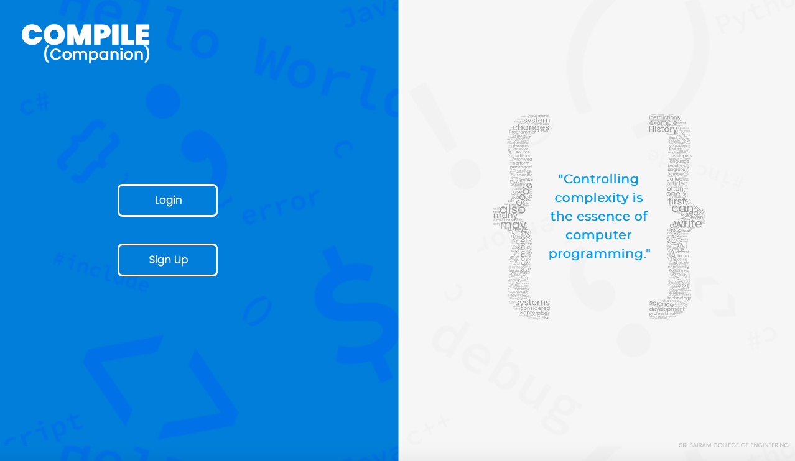

| [**Project-Gallery**](gallery.md) | 
|:----------|

### About

      
    <b>HAJA ASHIK S</b>  
    
I'm Full stack app developer persuing my degree from Sri Sairam College of Engineering Bangalore. I lik eto work more with flutter.

### Projects

    <h3 align="center">HASH-INCLUDE(#INCLUDE)</h3>
    

         
        <b>HASHINCLUDE</b>- it is a Mobile Application using the Flutter plugin of Android Studio, Firebase for the backend, and Figma for the designing.  #include application consists of a compiler, a discussion forum, a List of programs page and, YouTube tutorials for better understandingOur main objective is to make programming easier for students/(new) developers who are getting started with it.    
        

    

---

    <h3 align="center">COMPILE-ANYWHERE</h3>
    

         
        <b>COMPILE_ANYWHERE</b>- CompileAnywhwere is a mobile application using flutter framework which supports compile companion and provides a platform for all the students/beginners to make a step forward towards learning by promoting self-study.    
        

    

---

    <h3 align="center">COMPILE-COMPANION</h3>
    

         
        <b>COMPILE_COMPANION</b>- Compile companion is a single stop platform for all the programming labs of each semester in VTU that consists of  basic to advanced level programs uploaded by trained faculties of the institute.  It allows the faculties to upload, update , delete and execute their codes in the compiler section. Its uncomplicated design makes it easy to use.       
        

    

---

    <h3 align="center">G-QUIZ-MOBILE</h3>
    

         
        <b>G-QUIZ MOBILE</b>- G-Quiz mobile application is one stop solution for students as well as new developers for indepth learning in most organised manner which includes youtube tutorial course links and free material with quiz section for each and every topic.    
        

    

---

    <h3 align="center">G-QUIZ-WEB</h3>
    

         
        <b>G-QUIZ WEB</b>- G-Quiz web application is one stop solution for students as well as new developers for indepth learning in most organised manner which includes short demo video, youtube tutorial course links and free material with quiz section for each and every topic.    
        

    

---

<a href="Sce19cs046@sairamtap.edu.in"><b>📧 contact me!</b></a>
<a href="https://github.com/Ashik1103"><b>📧 Github</b></a>
<a href="https://www.linkedin.com/in/sce19cs046"><b>📧 Linkedin</b></a>